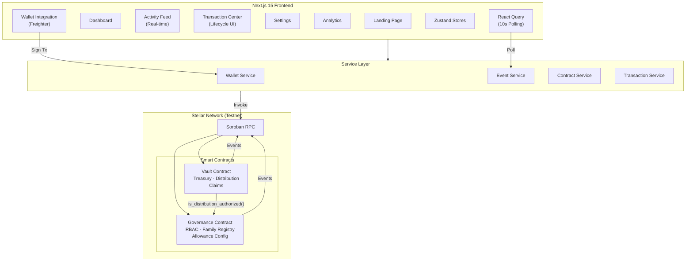
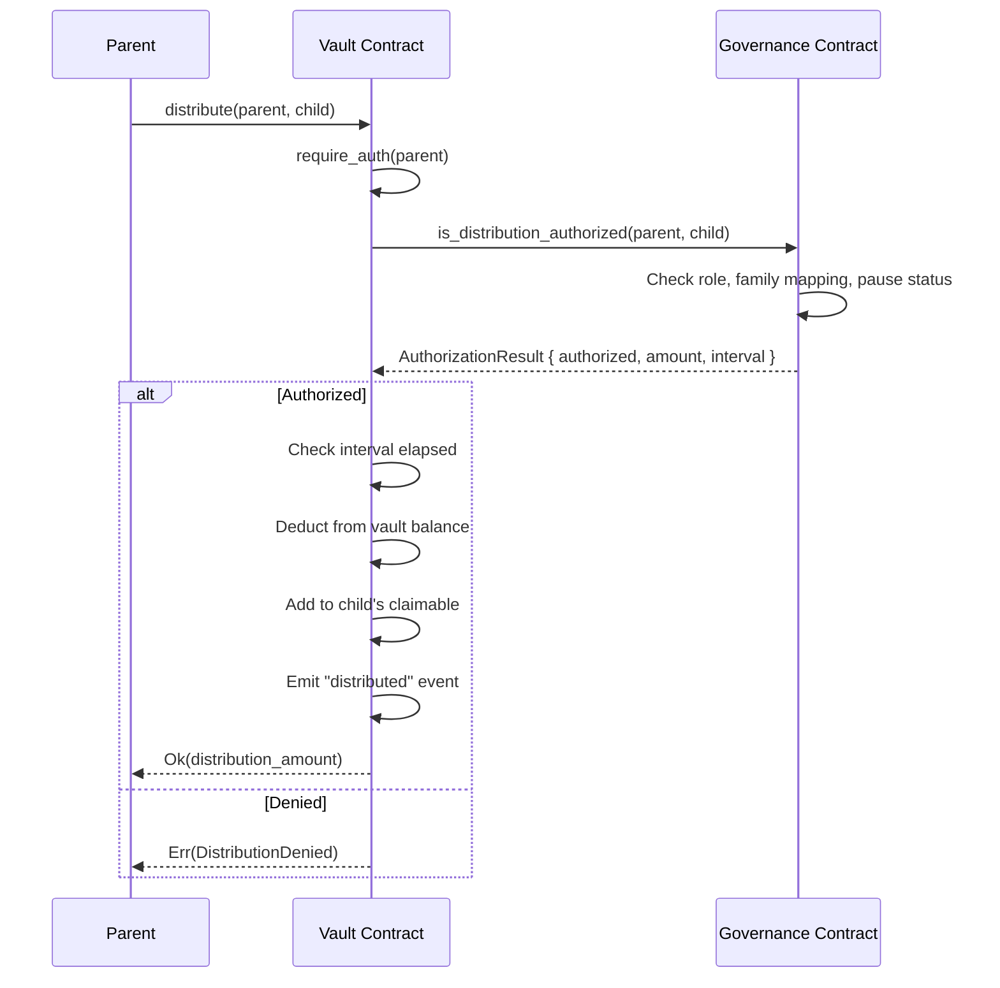

<div align="center">

# 🛡️ KithTrust

### The Family Allowance Manager — Decentralized on Stellar

*A programmable family treasury built on Soroban smart contracts. Automate allowances, teach financial literacy, and manage family finances transparently.*

[](https://github.com/kheyatari-cmd/kithtrust/actions/workflows/ci.yml)
[](https://github.com/kheyatari-cmd/kithtrust/actions/workflows/deploy.yml)

[Live Demo](#demo) · [Architecture](#architecture) · [Getting Started](#getting-started) · [Deployment](#deployment)

</div>

---

## 📋 Table of Contents

- [Product Overview](#product-overview)
- [Problem Statement](#problem-statement)
- [Solution](#solution)
- [Architecture](#architecture)
- [Smart Contract Design](#smart-contract-design)
- [Inter-Contract Communication](#inter-contract-communication)
- [Features](#features)
- [Tech Stack](#tech-stack)
- [Getting Started](#getting-started)
- [Environment Variables](#environment-variables)
- [Testing](#testing)
- [CI/CD Pipeline](#cicd-pipeline)
- [Deployment](#deployment)
- [Security Considerations](#security-considerations)
- [Contract Addresses](#contract-addresses)
- [Screenshots](#screenshots)
- [Demo](#demo)

---

## 🎯 Product Overview

**KithTrust** is a decentralized, programmable family allowance manager built on the Stellar network. It bridges the gap between digital financial literacy and automated parenting tools by providing a transparent, low-friction environment for managing kids' allowances, chores, and savings goals using native XLM or stablecoins.

### The Problem

Parents often struggle to consistently track and distribute weekly allowances, while children lack hands-on experience with modern digital finance. Traditional fiat banking apps for minors are burdened with custodial red tape, slow settlement times, and geographic restrictions, while physical cash is increasingly obsolete. There is no easy, trustless way for families to automate financial guardrails and teach Web3-native financial literacy in a safe sandbox.

### The Solution

KithTrust solves this by leveraging **Soroban smart contracts** to create a decentralized family treasury. Parents can deploy customized, time-locked allowance streams and set conditional transaction rules, while children get their first non-custodial wallet experience.

---

## 🏗️ Architecture



---

## 📜 Smart Contract Design

### Governance Contract (RBAC + Family Registry)

| Function | Access | Description |
|---|---|---|
| `initialize(admin)` | Once | Set admin and initial state |
| `add_parent(parent, name)` | Admin | Register a parent |
| `add_child(parent, child, name, amount, interval)` | Parent | Register child with allowance config |
| `remove_child(parent, child)` | Parent | Remove child from family |
| `set_allowance(parent, child, amount, interval)` | Parent | Update allowance configuration |
| `pause_family(caller, parent, paused)` | Admin/Parent | Pause/unpause distributions |
| `is_distribution_authorized(parent, child)` | Vault | Inter-contract auth check |
| `get_role(addr)` | Any | Query role (Admin/Parent/Child) |
| `get_children(parent)` | Any | List children for parent |
| `upgrade(new_wasm_hash)` | Admin | Upgrade contract |

**Storage Tiers:**
- **Instance**: Admin, vault contract address, global pause, max children
- **Persistent**: Role assignments, family mappings, allowance configs
- **Events**: `init`, `parent_added`, `child_added`, `child_removed`, `allow_upd`, `fam_pause`, `vault_link`

### Vault Contract (Treasury + Distribution)

| Function | Access | Description |
|---|---|---|
| `initialize(admin, governance)` | Once | Link to governance contract |
| `deposit(parent, amount)` | Parent | Deposit funds into family vault |
| `distribute(parent, child)` | Parent | Trigger allowance distribution (cross-contract call) |
| `claim(child)` | Child | Claim available balance |
| `emergency_withdraw(parent)` | Parent | Emergency withdrawal |
| `get_balance(parent)` | Any | Query vault balance |
| `get_claimable(child)` | Any | Query claimable amount |
| `upgrade(new_wasm_hash)` | Admin | Upgrade contract |

**Events**: `deposited`, `distributed`, `claimed`, `emergency`

---

## 🔗 Inter-Contract Communication

The Vault contract makes a **real cross-contract call** to the Governance contract during distribution:



---

## ✨ Features

- **🔐 Role-Based Access Control** — Admin, Parent, Child roles with enforcement
- **👨‍👩‍👧‍👦 Family Registry** — Map parents to children with on-chain records
- **💰 Programmable Allowances** — Weekly, bi-weekly, or monthly schedules
- **🏦 Decentralized Treasury** — Smart contract-managed vault
- **🔄 Inter-Contract Calls** — Real contract-to-contract communication
- **📡 Real-Time Events** — 10-second polling with live activity feed
- **📊 Transaction Lifecycle** — Pending → Processing → Confirmed → Failed + retry
- **👛 Wallet Integration** — Freighter with connect/disconnect/persistence
- **📱 Mobile Responsive** — Fully responsive glassmorphic UI
- **🎨 Web3 Dark Space** — Premium dark theme with micro-animations
- **⚡ Emergency Controls** — Pause distributions, emergency withdrawals
- **🔄 Upgradeable** — Admin-controlled contract upgrade path

---

## 🛠️ Tech Stack

| Layer | Technology |
|---|---|
| **Smart Contracts** | Rust, Soroban SDK 22.0 |
| **Frontend** | Next.js 15, TypeScript, React 19 |
| **Styling** | Tailwind CSS, shadcn/ui primitives |
| **State Management** | Zustand 5 |
| **Data Fetching** | TanStack React Query 5 |
| **Animations** | Framer Motion, CSS animations |
| **Charts** | Custom CSS charts, Recharts |
| **Wallet** | Freighter (Stellar wallet) |
| **Blockchain** | Stellar SDK 13, Soroban RPC |
| **Testing** | Vitest, React Testing Library, Cargo Test |
| **CI/CD** | GitHub Actions |
| **Deployment** | Stellar CLI, Vercel |

---

## 🚀 Getting Started

### Prerequisites

- **Rust** (1.75+): `curl --proto '=https' --tlsv1.2 -sSf https://sh.rustup.rs | sh`
- **WASM target**: `rustup target add wasm32-unknown-unknown`
- **Stellar CLI**: `cargo install --locked stellar-cli --features opt`
- **Node.js** (20+): [nodejs.org](https://nodejs.org/)
- **Freighter Wallet**: [freighter.app](https://freighter.app/)

### Clone & Setup

```bash
git clone https://github.com/kheyatari-cmd/kithtrust.git
cd kithtrust

# Copy environment files
cp .env.example .env
cp frontend/.env.example frontend/.env
```

### Build Contracts

```bash
cd contracts
cargo build --release --target wasm32-unknown-unknown
cargo test --workspace
cd ..
```

### Run Frontend

```bash
cd frontend
npm install
npm run dev
# Open http://localhost:3000
```

### Run Tests

```bash
# Contract tests
cd contracts && cargo test --workspace

# Frontend tests
cd frontend && npm run test
```

---

## 🔧 Environment Variables

| Variable | Description | Default |
|---|---|---|
| `NEXT_PUBLIC_STELLAR_NETWORK` | Network name | `testnet` |
| `NEXT_PUBLIC_STELLAR_RPC_URL` | Soroban RPC endpoint | `https://soroban-testnet.stellar.org` |
| `NEXT_PUBLIC_STELLAR_NETWORK_PASSPHRASE` | Network passphrase | `Test SDF Network ; September 2015` |
| `NEXT_PUBLIC_GOVERNANCE_CONTRACT_ID` | Deployed governance contract | — |
| `NEXT_PUBLIC_VAULT_CONTRACT_ID` | Deployed vault contract | — |
| `NEXT_PUBLIC_EXPLORER_URL` | Block explorer base URL | `https://stellar.expert/explorer/testnet` |

---

## 🧪 Testing

### Smart Contract Tests (Rust)

```bash
cd contracts
cargo test --workspace --verbose
```

**Test Coverage:**
- ✅ Initialization & double-init prevention
- ✅ RBAC enforcement (Admin/Parent/Child)
- ✅ Parent & child management (add, remove)
- ✅ Allowance configuration & updates
- ✅ Inter-contract authorization checks
- ✅ Pause/unpause functionality
- ✅ Deposit, claim, emergency withdrawal
- ✅ Invalid input handling (zero amounts, duplicates)

### Frontend Tests (Vitest + React Testing Library)

```bash
cd frontend
npm run test
```

**Test Coverage:**
- ✅ Wallet connect/disconnect UI states
- ✅ Dashboard stat cards and family member rendering
- ✅ Transaction lifecycle status display
- ✅ Explorer link generation
- ✅ Utility functions (address truncation, formatting)

---

## 🔄 CI/CD Pipeline

### PR Checks (`ci.yml`)
Triggered on every PR and push to `main`:

| Job | Steps |
|---|---|
| **Contract Tests** | `cargo fmt --check` → `cargo clippy` → `cargo test` → `cargo build --release (WASM)` |
| **Frontend Tests** | `npm ci` → `npm run lint` → `npm run test` → `npm run build` |

### Deploy (`deploy.yml`)
Triggered on merge to `main`:
- Builds production frontend
- Compiles contract WASMs and uploads as artifacts
- Vercel deployment ready (uncomment when configured)

---

## 📦 Deployment

### Deploy to Stellar Testnet

```bash
# 1. Install prerequisites (if not done)
rustup target add wasm32-unknown-unknown
cargo install --locked stellar-cli --features opt

# 2. Generate & fund deployer account
stellar keys generate --fund deployer

# 3. Run deployment script
chmod +x scripts/deploy.sh
./scripts/deploy.sh

# 4. (Optional) Initialize with test data
chmod +x scripts/initialize.sh
./scripts/initialize.sh <governance_id> <vault_id>
```

### Contract Upgrade

```bash
chmod +x scripts/upgrade.sh
./scripts/upgrade.sh governance <contract_id>
./scripts/upgrade.sh vault <contract_id>
```

### Deploy Frontend to Vercel

```bash
cd frontend
npx vercel --prod
```

---

## 🔒 Security Considerations

1. **Role-Based Access Control**: All state-changing functions enforce `require_auth()` and role verification
2. **Re-initialization Prevention**: Both contracts check `Initialized` flag to prevent re-init attacks
3. **Input Validation**: Allowance amounts must be positive; duplicate child addresses are rejected
4. **Time-Lock Enforcement**: Distribution intervals are enforced on-chain — cannot distribute more frequently than configured
5. **Emergency Controls**: Parents can pause distributions and perform emergency withdrawals
6. **Admin Upgrade Path**: Only the admin can upgrade contracts via `update_current_contract_wasm`
7. **Storage TTL Management**: All persistent data includes TTL extension to prevent archival
8. **Inter-Contract Verification**: Vault verifies authorization through Governance before every distribution
9. **No Raw Transfers in Demo**: Balance tracking is in-contract; production would integrate SAC (Stellar Asset Contract) for real token transfers
10. **Event Transparency**: All state changes emit events for frontend monitoring and audit trails

---

## 📍 Contract Addresses

> **Note:** Update these after deployment with `scripts/deploy.sh`

| Contract | Address | Explorer |
|---|---|---|
| **Governance** | `CC5JMWWNW5WURTTPQ2G4AJCDDXXOD5KCJNHTFQKGFG52FFOVTCOJ726C` | [View on Explorer](https://stellar.expert/explorer/testnet/contract/CC5JMWWNW5WURTTPQ2G4AJCDDXXOD5KCJNHTFQKGFG52FFOVTCOJ726C) |
| **Vault** | `CARJ5RQ37RM66GY635ILROUKZH25IEWP3DP5KMDKS7L64Q3C2NCBWLFH` | [View on Explorer](https://stellar.expert/explorer/testnet/contract/CARJ5RQ37RM66GY635ILROUKZH25IEWP3DP5KMDKS7L64Q3C2NCBWLFH) |

### Transaction Hashes

| Action | Hash | Explorer |
|---|---|---|
| Governance Init | `ba73737e163b2ba08894512eb7838ebabde4c0bce2d6712d2f0314ac5716141f` | [View](https://stellar.expert/explorer/testnet/tx/ba73737e163b2ba08894512eb7838ebabde4c0bce2d6712d2f0314ac5716141f) |
| Vault Init | `88f8e20cbac0700823b493a3f13c17f00c34c7ea36f128e0fb7dbdb76b83a2e9` | [View](https://stellar.expert/explorer/testnet/tx/88f8e20cbac0700823b493a3f13c17f00c34c7ea36f128e0fb7dbdb76b83a2e9) |
| Vault Link | `c06897bf0e4e012adb1c52e54e78b78f2f1eb81f96f17b6dcff34c3b837bf07c` | [View](https://stellar.expert/explorer/testnet/tx/c06897bf0e4e012adb1c52e54e78b78f2f1eb81f96f17b6dcff34c3b837bf07c) |

---

## 📸 Screenshots

> Add screenshots after running the frontend:

| View | Screenshot |
|---|---|
| Landing Page | *`<screenshot>`* |
| Dashboard | *`<screenshot>`* |
| Activity Feed | *`<screenshot>`* |
| Transaction Center | *`<screenshot>`* |
| Analytics | *`<screenshot>`* |
| Mobile View | *`<screenshot>`* |
| CI Pipeline | *`<screenshot>`* |
| Test Output | *`<screenshot>`* |

---

## 🎬 Demo

| Item | Link |
|---|---|
| **Live Demo** | `<PASTE_VERCEL_URL>` |
| **Demo Video** | `<PASTE_VIDEO_LINK>` |

---

## 📄 License

MIT License — see [LICENSE](LICENSE) for details.

---

<div align="center">

Built with ❤️ on [Stellar](https://stellar.org) · Powered by [Soroban](https://soroban.stellar.org)

</div>
